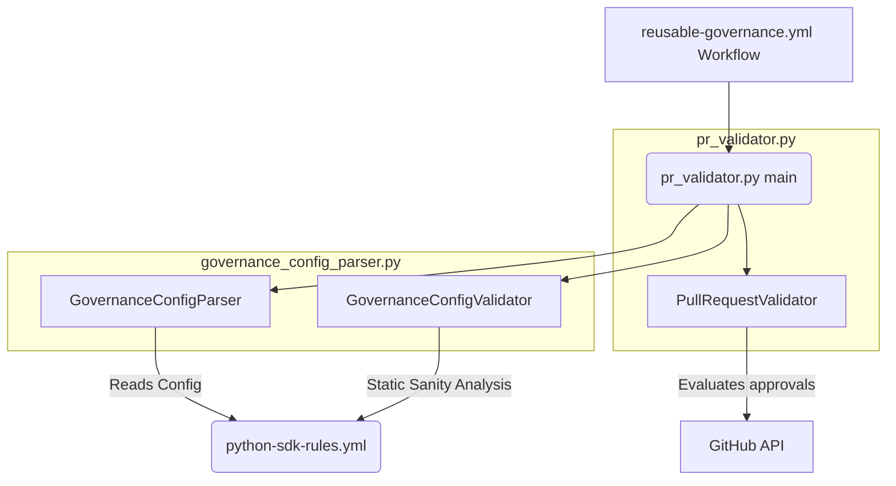

# GitHub Org Governance Tools - PR Validator

This directory contains the GitHub Org Governance validator tools. The `pr_validator.py` script acts as a CI/CD gated workflow step to enforce custom review rules and team-approval requirements on Pull Requests, using dynamic team hierarchies, file glob rules, and proxy review capabilities.

---

## Architecture Overview

The system consists of the following key components:



- **`pr_validator.py`**: The entrypoint script and validator logic.
  - `PullRequestValidator`: Fetches PR metadata (changed files, reviews, authors) from GitHub, queries team memberships, and evaluates reviews against the governance rules.
- **`governance_config_parser.py`**: Helper module for loading rules and analyzing configurations.
  - `GovernanceConfigParser`: Parses YAML configuration files into typed python dataclasses (`Team`, `GovernanceRule`, `GovernanceConfig`, etc.).
  - `GovernanceConfigValidator`: Performs static analysis on the repository files to detect rule design flaws (overlapping rules or files falling into default fallbacks).

---

## Configuration Schema

Governance rules are defined using YAML. Below is an overview of the configuration schema (e.g. `rules/python-sdk-rules.yml`):

### 1. `team_hierarchy`

Defines hierarchical roles with integer clearance tiers. Approvals from higher levels automatically satisfy requirements for lower levels (e.g. an approval from a level 4 member counts as a level 2 approval):

```yaml
team_hierarchy:
  devops-maintainers: 1
  maintainers: 2
  tech-council: 3
  governance-council: 4
```

### 2. `fallback`

Defines catch-all requirements applied to any file that does not match a specific custom rule:

```yaml
fallback:
  requires:
    - min_team: "maintainers"
      min_approvals: 1
```

### 3. `rules`

A list of review criteria matching specific file glob patterns:

- `patterns`: File paths or wildcards (supports `*`, `**`, `?` globs) matching target files.
- `excludes`: Optional glob patterns to exclude from the rule.
- `requires`: The specific approval targets:
  - `team`: Requires an approval from an exact team.
  - `min_team`: Requires an approval from the specified team or any team higher in the hierarchy.
  - `min_approvals`: Number of approvals required from members of that team/tier.

```yaml
rules:
  - name: "core_protocol_src"
    patterns:
      - "source/**"
    requires:
      - min_team: "tech-council"
        min_approvals: 1
```

### 4. `proxy_reviewers`

A list of GitHub usernames allowed to approve PRs on behalf of any required team (see [GOVERNANCE.md](../../GOVERNANCE.md#governing-council-gc) for details on proxy voting rights).

```yaml
proxy_reviewers:
  - user_a
  - user_b
```

---

## How It Works

### Step 1: Static Config Verification

Before checking any PR, `pr_validator.py` instantiates the `GovernanceConfigValidator` to perform static validation checks:

1.  **Overlap Detection**: Verifies that no file in the repository matches more than one rule (to prevent conflicting requirements).
2.  **Coverage Verification (No-Fallback)**: If strict coverage is desired, it verifies that every single tracked file in the repository matches at least one explicit rule.

### Step 2: PR Evaluation Logic

When evaluating a pull request:

1.  **Filter Author**: The PR author's own approvals are ignored.
2.  **Match Rules**: Compares all modified files in the PR against the rules to collect the matching `RuleRequirement` sets. If a file matches no rule, the `fallback` requirements are applied.
3.  **Resolve Approvals**:
    - Retrieves active PR reviews from GitHub.
    - Checks if the reviewer is a proxy reviewer.
    - Queries team memberships for reviewers from the GitHub API.
    - Maps team memberships to hierarchical levels.
4.  **Evaluate Gates**: Validates that the approvals fulfill every required target. Prints results and writes a review summary to `summary.txt`.

---

## CLI Usage

Run the validator CLI command from this directory:

```bash
python3 scripts/pr_validator.py \
  --token "<GITHUB_TOKEN>" \
  --org "<ORG_NAME>" \
  --repo "<REPO_PATH>" \
  --pr <PR_NUMBER> \
  --rules-file "<PATH_TO_RULES_YAML>"
```

### CLI Arguments:

- `--token`: Org-level read token for GitHub REST API calls (requires permission to read team memberships).
- `--org`: The GitHub organization name.
- `--repo`: The full GitHub repository path (e.g. `Universal-Commerce-Protocol/python-sdk`). If `--rules-file` is not provided, the script resolves the rules file by convention: it looks for a file named `<repo-name-suffix>-rules.yml` under `org-tools/governance/rules/` (e.g., `python-sdk-rules.yml`).
- `--pr`: The PR number to validate.
- `--rules-file`: Optional path to the governance rules YAML file. If provided, it overrides the convention-based path resolution.

---

## Running Unit Tests

The test suite mock-patches the GitHub API and local git files to allow fast, isolated test runs:

```bash
# Run pr_validator tests
python3 org-tools/governance/tests/test_pr_validator.py

# Run config parser and validator tests
python3 org-tools/governance/tests/test_governance_config_parser.py
```
